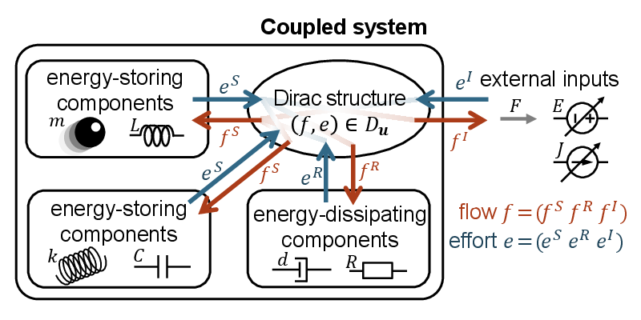

# Poisson-Dirac Neural Networks for Modeling Coupled Systems across Physics Domains (ICLR 2025)

Official paper page: [OpenReview](https://openreview.net/forum?id=U1DjXQeJRx), [arXiv](https://arxiv.org/abs/2410.11480)

## Highlights

<p align="center">
  
</p>

## Abstract

Deep learning has achieved great success in modeling dynamical systems, providing data-driven simulators to predict complex phenomena, even without known governing equations. However, existing models have two major limitations: their narrow focus on mechanical systems and their tendency to treat systems as monolithic. These limitations reduce their applicability to dynamical systems in other domains, such as electrical and hydraulic systems, and to coupled systems. To address these limitations, we propose Poisson-Dirac Neural Networks (PoDiNNs), a novel framework based on the Dirac structure that unifies the port-Hamiltonian and Poisson formulations from geometric mechanics. This framework enables a unified representation of various dynamical systems across multiple domains as well as their interactions and degeneracies arising from couplings. Our experiments demonstrate that PoDiNNs offer improved accuracy and interpretability in modeling unknown coupled dynamical systems from data.

## Requirements

- Python v3.11.9
- numpy v1.26.4
- scipy v1.12.1
- pytorch v2.3.1
- desolver v4.1.1

All datasets for reproducing our results are generated by numerical simulations. The source code for dataset generation is located in `dataset/*.py`, which will be automatically executed if needed.

## Training

To start training the model, use the following command:

```sh
python main.py --seed SEED --dataset DATASET --model MODELNAME
```

Replace the placeholders with your desired configuration:

- `SEED`: Seed value for reproducibility.
- `DATASET`: Name of the dataset.
- `MODELNAME`: Specify the model architecture to be used.

### Available Datasets

- **msdFrel**: (a) mass-spring-damper system with external force in the relative coordinate system.
- **msdFabs**: (a') mass-spring-damper system with external force in the absolute coordinate system.
- **msdBrel**: (b) mass-spring-damper system with moving boundary in the relative coordinate system.
- **msdBabs**: (b') mass-spring-damper system with moving boundary in the absolute coordinate system.
- **ms2Dim**: (c) 2D mass-spring system with redundant observations.
- **fhn**: (d) FitzHugh-Nagumo model.
- **chua**: (e) Chua's circuit.
- **dcmotor**: (f) DC motor with an electric circuit and a pendulum.
- **tank**: (g) hydraulic tank with two pistons in cylinders.

### Available Models

- **node**: Neural ODEs for (a)--(g).
- **porthnn**: Dissipative SymODENs for (a).
- **pnn**: Poisson neural networks for (c).
- **podinn**: PoDiNNs in relative coordinate system for (a)(b)(d)(e)(g).
- **podinnabs**: PoDiNNs in absolute coordinate system for (a')(b').
- **podinn2dim**: PoDiNNs in 2-dimensional relative coordinate system for (c).
- **podinndc**: PoDiNNs for DC motor (f).

### Options for PoDiNNs

- `--linear_I`: Assume the kinetic energy is quadratic. Use this for any mass and linear inductors.
- `--linear_C`: Assume the potential energy is quadratic. Use this for linear capacitors.
- `--set_d`: Change the number of energy-dissipating elements whose flow is velocity or current.
- `--set_g`: Change the number of energy-dissipating elements whose flow is force or voltage.

### Training Commands

```sh
# system (a)
python main.py --seed 0 --dataset msdFrel --model node
python main.py --seed 0 --dataset msdFrel --model porthnn
python main.py --seed 0 --dataset msdFrel --model poddinn --linear_I
# system (a')
python main.py --seed 0 --dataset msdFabs --model node
python main.py --seed 0 --dataset msdFabs --model porthnn
python main.py --seed 0 --dataset msdFabs --model poddinnabs --linear_I
# system (b)
python main.py --seed 0 --dataset msdBrel --model node
python main.py --seed 0 --dataset msdBrel --model porthnn
python main.py --seed 0 --dataset msdBrel --model poddinn --linear_I
# system (b')
python main.py --seed 0 --dataset msdBabs --model node
python main.py --seed 0 --dataset msdBabs --model porthnn
python main.py --seed 0 --dataset msdBabs --model poddinnabs --linear_I
# system (c)
python main.py --seed 0 --dataset ms2Dim --model node
python main.py --seed 0 --dataset ms2Dim --model pnn
python main.py --seed 0 --dataset ms2Dim --model poddinn2dim --linear_I
# system (d)
python main.py --seed 0 --dataset fhn --model node
python main.py --seed 0 --dataset fhn --model poddinn --linear_I --linear_C
# system (e)
python main.py --seed 0 --dataset chua --total_steps 100000 --model node
python main.py --seed 0 --dataset chua --total_steps 100000 --model poddinn --linear_I --linear_C
# system (f)
python main.py --seed 0 --dataset dcmotor --total_steps 100000 --model node
python main.py --seed 0 --dataset dcmotor --total_steps 100000 --model poddinndc --linear_I --linear_C
# system (g)
python main.py --seed 0 --dataset tank --total_steps 100000 --model node
python main.py --seed 0 --dataset tank --total_steps 100000 --model poddinn --linear_I
```

### Others

```sh
# Obtain the performance on the training subset after training
python eval_train.py --seed SEED --dataset DATASET --model MODELNAME
```

## Results

The results of our experiments, including performance metrics and visualizations, can be found in the `results/` directory.

## Citation

```bibtex
@InProceedings{Khosrovian2025ICLR,
  title     = {Poisson-Dirac Neural Networks for Modeling Coupled Systems across Physics Domains},
  author    = {Razmik Arman Khosrovian and Takaharu Yaguchi and Hiroaki Yoshimura and Takashi Matsubara},
  booktitle = {Proceedings of the International Conference on Learning Representations (ICLR)},
  month     = {Apr.},
  year      = {2025},
}
```
